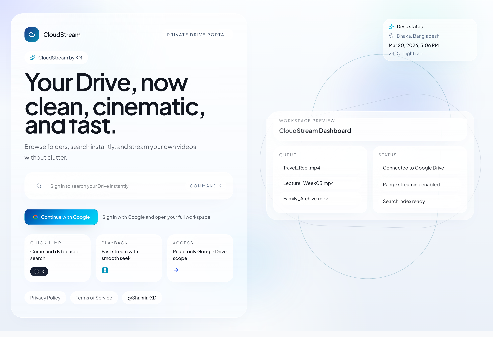

# CloudStream by KM

[](https://nextjs.org/)
[](https://www.typescriptlang.org/)
[](https://authjs.dev/)
[](https://vercel.com/)
[](#license)

CloudStream is a private Google Drive streaming workspace built with Next.js App Router. It allows users to authenticate with Google, browse their Drive files, and stream video content through a secure range-enabled proxy.

## Preview



Live app: https://gdrive-proxy-player.vercel.app/

## Highlights

- Google OAuth authentication with Auth.js (NextAuth)
- My Drive browsing with folder navigation and search
- Built-in video player with seek support and fullscreen
- Range-aware API proxy for smooth Drive video streaming
- Keyboard search shortcut (Command/Ctrl + K)
- Security hardening for headers and streaming endpoints

## Tech Stack

- Next.js 15 (App Router)
- TypeScript
- Auth.js / NextAuth v5
- Tailwind CSS v4 + shadcn/ui
- Google Drive REST API
- Vercel (deployment)

## Project Structure

```text
src/
	app/
		api/
			auth/[...nextauth]/route.ts
			stream/[fileId]/route.ts
	components/
		auth/
		cloudstream/
		ui/
	lib/
		env.ts
		google-drive.ts
```

## Environment Variables

Create a local .env.local file:

```bash
NEXTAUTH_URL=http://localhost:3000
NEXTAUTH_SECRET=PUT_YOUR_OWN_KEY
GOOGLE_CLIENT_ID=PUT_YOUR_OWN_KEY
GOOGLE_CLIENT_SECRET=PUT_YOUR_OWN_KEY
```

### Variable Reference

| Variable             | Required | Description                |
| -------------------- | -------- | -------------------------- |
| NEXTAUTH_URL         | Yes      | Application base URL       |
| NEXTAUTH_SECRET      | Yes      | Session/JWT signing secret |
| GOOGLE_CLIENT_ID     | Yes      | Google OAuth client ID     |
| GOOGLE_CLIENT_SECRET | Yes      | Google OAuth client secret |

## Google OAuth Setup

1. Open Google Cloud Console.
2. Enable Google Drive API.
3. Create OAuth 2.0 credentials (Web application).
4. Add Authorized JavaScript origins:
   - http://localhost:3000
5. Add Authorized redirect URIs:
   - http://localhost:3000/api/auth/callback/google

## Run Locally

```bash
npm install
npm run dev
```

Open http://localhost:3000

## Deployment (Vercel)

1. Import repository into Vercel.
2. Add all required environment variables for Production.
3. Set NEXTAUTH_URL to your production domain.
4. Redeploy after any OAuth or environment change.

## Security Notes

- API routes are protected by authentication middleware.
- Stream endpoint validates file identifiers and range headers.
- Security response headers are configured globally.
- Never commit real secrets to the repository.

## Troubleshooting

### OAuth error: invalid_client

- Verify GOOGLE_CLIENT_ID and GOOGLE_CLIENT_SECRET in Vercel.
- Confirm redirect URI matches exactly in Google Console.
- Redeploy after updating environment variables.

### Link preview not updating

- Social platforms cache metadata aggressively.
- Re-scrape the URL with platform debug tools or wait for cache refresh.

## Roadmap

- Add richer file filters and advanced sorting
- Improve video player with subtitle support
- Add pagination and incremental loading for large folders
- Add activity/event logging for account-level observability
- Expand settings panel for personalized workspace preferences

## Contributing

This repository is currently maintained as a private project, but contributions and suggestions are welcome.

1. Fork the repository
2. Create a feature branch
3. Commit focused, descriptive changes
4. Open a pull request with context and screenshots (if UI changes)

Please keep pull requests small, test your changes locally, and avoid committing secrets or generated environment files.

## License

Private project. All rights reserved unless stated otherwise.


## 👨‍💻 Author

**Developed with ❤️ by K M SHAHRIAR HOSSAIN**
